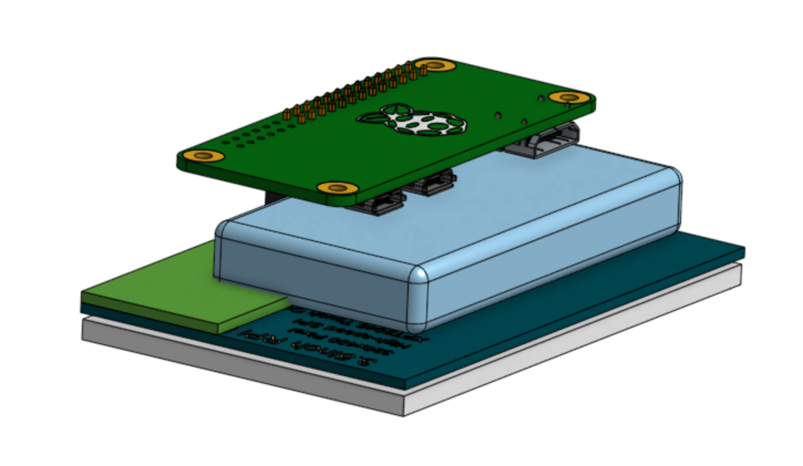
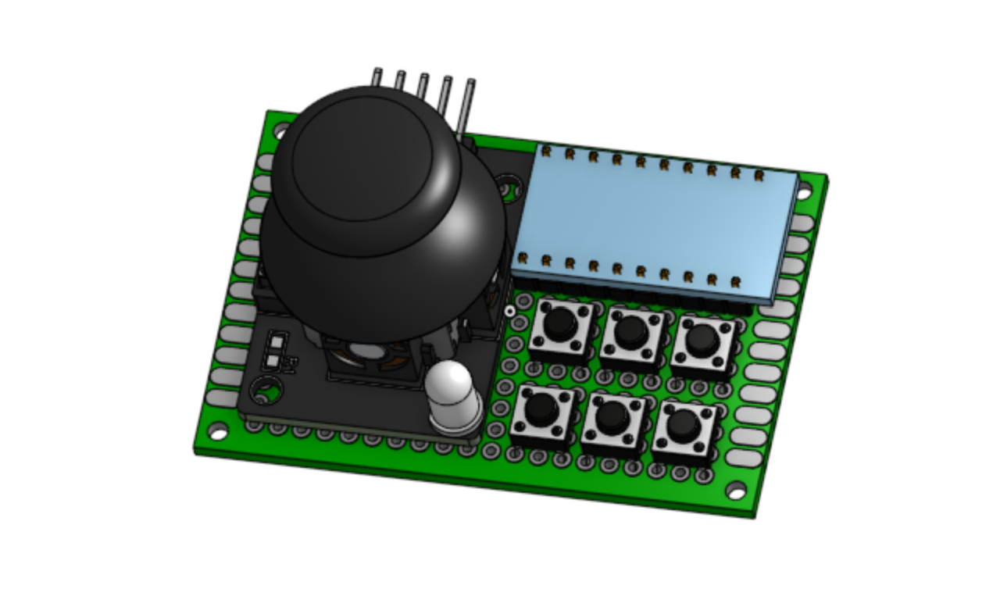
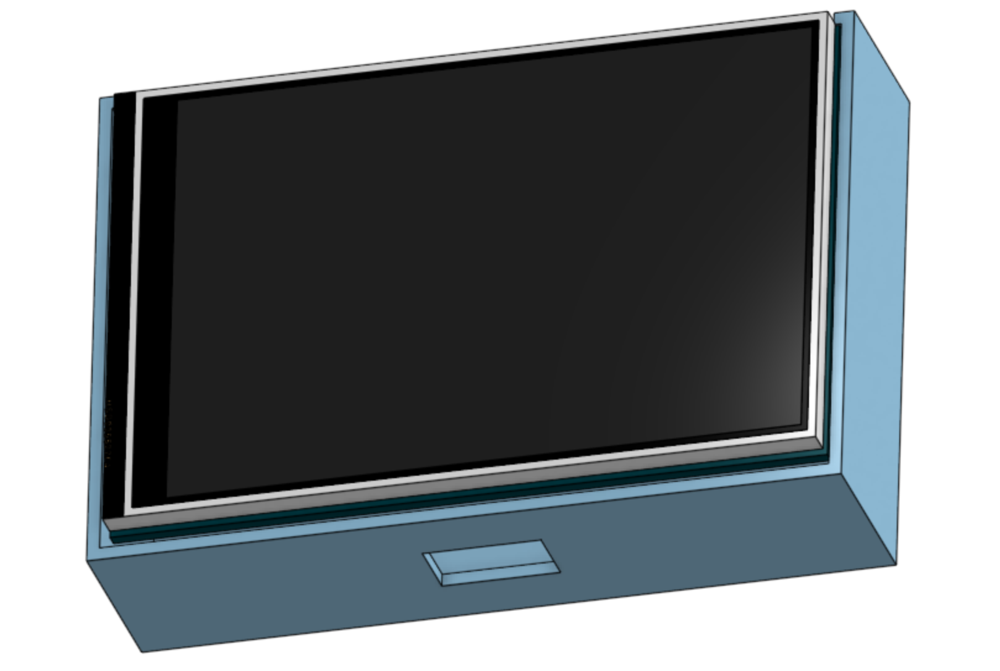

# CrackerZero
A portable, Raspberry Pi 0-powered cyberdeck! My first cyberdeck too (: it's thin and light like a cracker

The Cracker Zero will be my first cyberdeck! The reason as to why I chose a Pi 0 instead of a Pi 4 or 5 is because I wanted extra space and budget to make a custom keyboard. It'll be nothing fancy, just a couple of push buttons and a joystick on a perfboard, but I can say that it is my own (: I'm planning on running some kind of Linux.

# Wiring Diagram

Wiring diagram for the Pi:

| Left row | Function | Use | Right row | Function | Use |
|---:|---|---|---:|---|---|
| **1** | 3.3 V | SCREEN | **2** | 5 V | SCREEN / same 5 V rail as power input |
| **3** | GPIO 2 / SDA | SCREEN | **4** | 5 V | SCREEN / same 5 V rail as power input |
| **5** | GPIO 3 / SCL | SCREEN | **6** | GND | SCREEN |
| **7** | GPIO 4 | SCREEN | **8** | GPIO 14 / TXD | SCREEN |
| **9** | GND | SCREEN | **10** | GPIO 15 / RXD | SCREEN |
| **11** | GPIO 17 | SCREEN | **12** | GPIO 18 | SCREEN |
| **13** | GPIO 27 | SCREEN | **14** | GND | SCREEN |
| **15** | GPIO 22 | SCREEN | **16** | GPIO 23 | SCREEN |
| **17** | 3.3 V | SCREEN | **18** | GPIO 24 | SCREEN |
| **19** | GPIO 10 / MOSI | SCREEN | **20** | GND | SCREEN |
| **21** | GPIO 9 / MISO | SCREEN | **22** | GPIO 25 | SCREEN |
| **23** | GPIO 11 / SCLK | SCREEN | **24** | GPIO 8 / CE0 | SCREEN |
| **25** | GND | SCREEN | **26** | GPIO 7 / CE1 | SCREEN |
| **27** | GPIO 0 / ID_SD | Leave unused | **28** | GPIO 1 / ID_SC | Leave unused |
| **29** | GPIO 5 | Available | **30** | GND | Available |
| **31** | GPIO 6 | Available | **32** | GPIO 12 | Available |
| **33** | GPIO 13 | Available | **34** | GND | Available |
| **35** | GPIO 19 | Available | **36** | GPIO 16 | Available |
| **37** | GPIO 26 | Available | **38** | GPIO 20 | Available |
| **39** | GND | Available | **40** | GPIO 21 | Available |

A 22 AWG wire will be soldered onto the 5v wires from the TP4056 module. The GND will be soldered to one of the empty ground pins. I really wish they'd make the screen use only one 5V pin :P

Wiring diagram for the CH32X035 devboard keyboard:

| LEFT SIDE | USE | RIGHT SIDE | USE |
|---|---|---|---|
| 5V | USB power | GND | Ground |
| GND | Ground | PC19 | Unused |
| 3V3 | KY-023 VCC | PB12 | Button 1 |
| PA0 | Joystick X | PC18 | Unused |
| PA1 | Joystick Y | PB11 | Button 2 |
| PA2 | Joystick Click | PB3 | Button 3 |
| PA3 | Layer LED | PB1 | Button 4 |
| PA4 | Spare | PB0 | Button 5 |
| PA5 | Spare | PA7 | Button 6 |
| — | — | PA6 | Spare |

I chose not to CAD a case for the keyboard to get the see the art from Cyao on the CH32X035 :D

# CAD

There wasn't much CADing to do for the Cracker Zero! I just make sure that I knew where to put all the parts, here:

And I made a case for the Pi and the screen, here:

Of course, I had to CAD the cute little keyboard

# Assembly

Assembling the Cracker Zero won't be very hard. Just find two 13-pin-long pin headers and solder them onto the first 13 pin slots of both rows on the Pi 0. Solder the Lipo's spliced wires onto the protection module's BAT+ and BAT- pads, and solder the protection module's Input/Output +/- pads to the TP4056 module's BAT+/- pins. Wire the TP4056's OUT+ to one of the Pi's 5V pins (using the latching button), and wire the OUT- to any of the Pi's GNDs. The Cracker Zero charges using micro USB (I know I know diabolical). Solder the keyboard according to the wiring diagram, and connect it to the Pi's data micro USB port using a USB-C to micro USB power/data cable. 

# AI Use

AI was used to find good parts/deals. 
